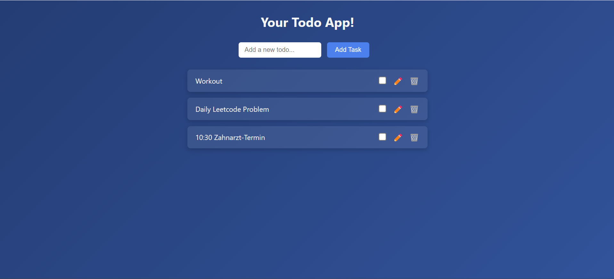

# ✅ Todo-App – Vanilla JavaScript

Ein einfaches, aber funktionsreiches ToDo-Tool, das mit HTML, CSS und JavaScript ohne Frameworks entwickelt wurde.  
Ziel war es, die Grundlagen von DOM-Manipulation, Event-Handling und sauberem Codeaufbau durch ein echtes Mini-Projekt zu festigen.

## 🔧 Features

- 📋 Aufgaben hinzufügen
- ✅ Aufgaben als erledigt markieren
- 📝 Aufgaben umbenennen (Edit-Button)
- 🗑️ Aufgaben löschen
- 🎨 Modernes, responsives UI mit blauem Theme
- ✨ Modularer JavaScript-Code mit guter Struktur

## 📂 Technologien

- HTML5  
- CSS3 (flexbox, shadows, theming)  
- Vanilla JavaScript (DOM, Events, Funktionen)

## 💡 Warum dieses Projekt?

Dieses Projekt wurde im Rahmen meines Lernpfads als angehender Fullstack-Developer umgesetzt.  
Ich wollte bewusst auf Frameworks verzichten, um den direkten Umgang mit dem DOM und browserseitigem JavaScript zu trainieren.

## 📷 Vorschau

## 🧠 Gelerntes

- Strukturierung von JavaScript mit Hilfsfunktionen  
- Dynamisches Erstellen & Entfernen von Elementen  
- Aufbau eigener Komponentenlogik (edit/delete handlers)  
- Styling & UX mit reinem CSS  
- Clean Code Prinzipien bei kleinen Projekten anwenden

## 📎 Autor

**Huy Minh To**  
[GitHub-Profil ansehen](https://github.com/HuyMinhTo)

